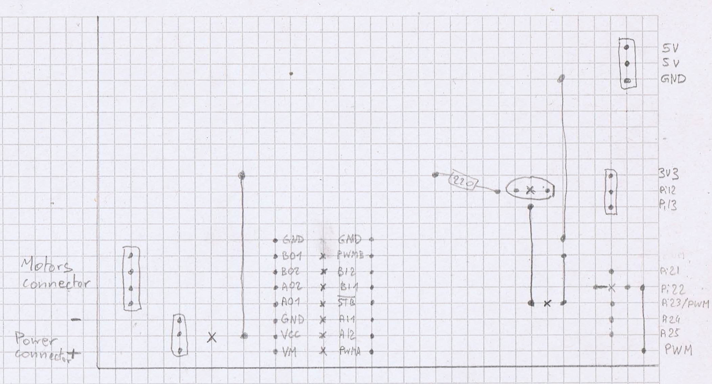

# Connect ps3 controller to the rpi 3

Follow [this guid](https://pimylifeup.com/raspberry-pi-playstation-controllers/)

test with

```
jstest /dev/input/js0
```

# Raspberry pi custom hat

## Pinout

| Usage | BCM pin  | wiring pi pin |
|-------|----------|---------------|
| LED   | 10       | 12            |
| PWMA  | 12       | 26            |
| IN1A  | 19       | 24            |
| IN2A  | 26       | 25            |
| PWMB  | 13       | 23            |
| IN1B  | 6        | 22            |
| IN2B  | 5        | 21            |
| STDBY | 9        | 13            |

## Schema



## Parts

  - PS3 remote
  - Raspberry pi 3
  - [2 wheel + motor + frame + 4xAA battery holder](https://alexnld.com/product/2wd-smart-robot-car-chassis-kit-speed-encoder-battery-box-arduino-2-motor-1-48/)
  - [SparkFun Dual Motor Driver](https://www.sparkfun.com/products/14450)
  - veroboard, headers, ...

# App

## Depend

It use [a c++ joysitck library](https://github.com/drewnoakes/joystick) as submodule.

## Compile

Run

```
./build.sh
```
